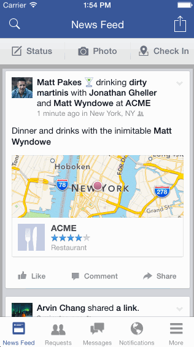

Week 5 Homework

#### How many hours to complete ?

    15 Hrs

#### Which required and optional stories have been completed ?

- Create a scrollable view of Facebook notifications, such as the one above. Read the required and optional items below.
    - (✓) Create a custom cell for the notification
    - (✓) Set the left navigation bar icon to the search icon
    - (✓) Set the right navigation bar icon to the messages icon
    - (✓) Images can be loaded locally or from a URL. The quick references below demonstrate an easy way to load them from a URL
    - (✓) Optional: Create a Notification model class with properties for profilePicUrl, text, iconUrl, timestamp
    - (✓) Optional: Implement a functioning tab bar that can be switched between news feed and notifications
    - (x) Optional: Implement a scrollable version of news feed that contains your post from the Week 1 assignment

#### Walkthrough

